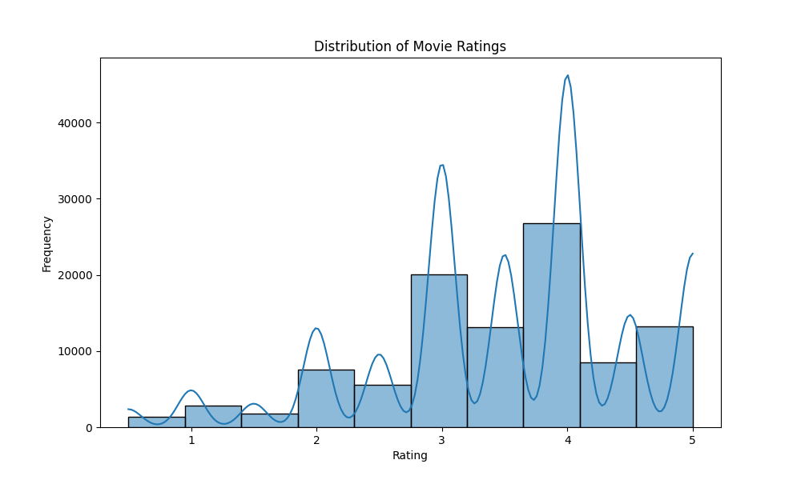

# Movie Recommendation System

This project uses PyTorch to build a movie recommendation system based on user ratings. It includes a Flask web interface for generating recommendations and an exploratory data analysis (EDA) to understand the dataset.


## Features

- **Interactive Interface**: Built with Flask and modern CSS, inspired by streaming platforms like Netflix and Disney+.
- **Model Training**: Uses PyTorch for training a recommendation model.
- **Exploratory Data Analysis (EDA)**: Analyzes user ratings and movie metadata to identify key trends.
- **Deployment**: Can be deployed locally or on platforms like Heroku.

## Exploratory Data Analysis (EDA)
#### Distribution of Movie Ratings


#### Number of Ratings per User


#### Number of Ratings per Movie


## Installation

1. Clone this repository:
   ```bash
   git clone https://github.com/Adlan-Boithier/MovieRecommendation.git